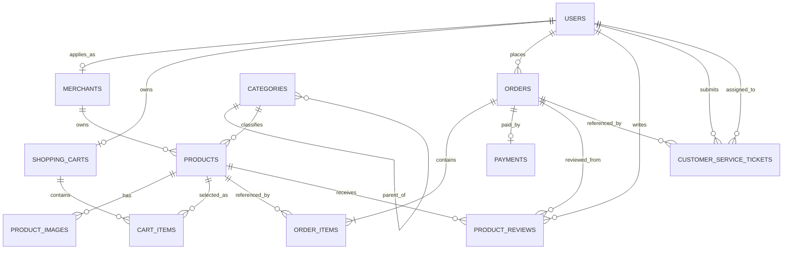

# 数据库设计说明

本文档说明 Tongji-Retail 在 Oracle Database XE 21c 中使用的 12 张核心数据表、字段含义、主外键、唯一约束、检查约束、索引、删除规则及主要业务流转。

数据库模型的唯一实现来源是：

- `backend/src/Models/`
- `backend/src/Data/AppDbContext.cs`
- `backend/src/Data/DatabaseInitializer.cs`

项目使用 EF Core `EnsureCreated` 自动建表，没有使用迁移文件。修改实体、约束或索引后，既有 Oracle 数据卷不会自动升级；开发环境需要备份数据后重建数据卷，或另行编写正式迁移脚本。

## 1. 总体设计

### 1.1 十二张核心表

| 序号 | 表名 | 主要用途 |
| --- | --- | --- |
| 1 | `USERS` | 保存顾客、商家、管理员和客服账号 |
| 2 | `MERCHANTS` | 保存商家入驻资料和审核状态 |
| 3 | `CATEGORIES` | 保存支持多级父子关系的商品分类 |
| 4 | `PRODUCTS` | 保存商品主体、库存、销量和评分聚合 |
| 5 | `PRODUCT_IMAGES` | 保存商品图片及主图顺序 |
| 6 | `SHOPPING_CARTS` | 保存用户的一对一购物车 |
| 7 | `CART_ITEMS` | 保存购物车中的商品和数量 |
| 8 | `ORDERS` | 保存订单主信息和状态 |
| 9 | `ORDER_ITEMS` | 保存订单商品明细及成交价格快照 |
| 10 | `PAYMENTS` | 保存一对一模拟支付和退款状态 |
| 11 | `PRODUCT_REVIEWS` | 保存已完成订单的商品评价 |
| 12 | `CUSTOMER_SERVICE_TICKETS` | 保存顾客工单、分配客服及回复状态 |

### 1.2 关系概览



### 1.3 类型和命名说明

EF Core 属性名作为数据库列名，表名在 `AppDbContext` 中显式指定为大写。以下类型中：

- `NUMBER(18,2)`、`NUMBER(3,2)`、`NUMBER(10)`、`NUMBER(1)` 和 `CLOB` 是代码中显式配置的 Oracle 类型。
- `long`、`int`、`DateTime` 和限定长度字符串的最终物理类型由 Oracle EF Core 9 提供程序生成；通常分别对应 `NUMBER(19)`、`NUMBER(10)`、`TIMESTAMP(7)` 和 `NVARCHAR2(n)`。
- 精确的生产 DDL 应以实际 Oracle 数据字典为准，例如查询 `USER_TAB_COLUMNS`、`USER_CONSTRAINTS` 和 `USER_INDEXES`。
- `CreatedAt`、`UpdatedAt` 等默认值是在应用程序实体初始化时产生，不是 Oracle 列级默认值。

### 1.4 UTC 时间约定

项目中的所有 `DateTime` 业务时间均使用 `DateTime.UtcNow` 写入数据库。Oracle `DATE/TIMESTAMP` 不保存 .NET 的 `DateTime.Kind`，读取后通常会成为 `Unspecified`。后端通过 `UtcDateTimeJsonConverter` 将其恢复为 UTC，并以带 `Z` 的 ISO 8601 字符串输出，例如：

```json
{
  "expireAt": "2026-08-05T08:14:53Z"
}
```

浏览器再根据用户本地时区显示时间。数据库中不要混入本地时间值，否则会被当作 UTC 解释。

## 2. 状态枚举

数据库以整数保存枚举，API 以字符串输出和接收枚举。

### 2.1 用户角色 `UserRole`

| 数值 | API 名称 | 含义 |
| --- | --- | --- |
| 0 | `Admin` | 管理员 |
| 1 | `Customer` | 顾客 |
| 2 | `Merchant` | 商家 |
| 3 | `CustomerService` | 客服 |

### 2.2 商家状态 `MerchantStatus`

| 数值 | API 名称 | 含义 |
| --- | --- | --- |
| 0 | `Pending` | 待审核 |
| 1 | `Approved` | 已通过 |
| 2 | `Rejected` | 已拒绝 |

### 2.3 商品状态 `ProductStatus`

| 数值 | API 名称 | 含义 |
| --- | --- | --- |
| 0 | `PendingReview` | 待审核 |
| 1 | `OnSale` | 已上架 |
| 2 | `OffShelf` | 已下架 |
| 3 | `Rejected` | 已拒绝 |

### 2.4 订单状态 `OrderStatus`

| 数值 | API 名称 | 含义 |
| --- | --- | --- |
| 0 | `PendingPayment` | 待支付 |
| 1 | `PendingShipment` | 待发货 |
| 2 | `Shipped` | 已发货 |
| 3 | `Completed` | 已完成 |
| 4 | `Cancelled` | 已取消 |

### 2.5 支付方式 `PaymentMethod`

| 数值 | API 名称 | 含义 |
| --- | --- | --- |
| 0 | `Alipay` | 支付宝模拟支付 |
| 1 | `WeChat` | 微信模拟支付 |
| 2 | `CreditCard` | 信用卡模拟支付 |

### 2.6 支付状态 `PaymentStatus`

| 数值 | API 名称 | 含义 |
| --- | --- | --- |
| 0 | `Pending` | 待处理 |
| 1 | `Success` | 支付成功 |
| 2 | `Failed` | 支付失败 |
| 3 | `Refunded` | 已退款 |

### 2.7 工单状态 `TicketStatus`

| 数值 | API 名称 | 含义 |
| --- | --- | --- |
| 0 | `Pending` | 待处理 |
| 1 | `Processing` | 处理中 |
| 2 | `Resolved` | 已解决 |
| 3 | `Closed` | 已关闭 |

## 3. 表结构详解

## 3.1 `USERS` 用户表

保存所有系统账号。一个用户最多关联一个商家资料和一个购物车。

| 字段 | EF 类型 / Oracle 映射 | 可空 | 说明 |
| --- | --- | --- | --- |
| `Id` | `long` / 通常 `NUMBER(19)` | 否 | 主键，数据库生成 |
| `Username` | `string(50)` | 否 | 登录用户名 |
| `PasswordHash` | `string(255)` | 否 | BCrypt 密码哈希，不保存明文密码 |
| `Email` | `string(100)` | 是 | 电子邮箱 |
| `Phone` | `string(20)` | 是 | 手机号或联系电话 |
| `Role` | `NUMBER(10)` | 否 | 用户角色，范围 0—3 |
| `IsActive` | `NUMBER(1)` | 否 | 账号是否启用，0 或 1 |
| `CreatedAt` | `DateTime` / 通常 `TIMESTAMP(7)` | 否 | UTC 注册时间 |

约束与索引：

- 主键：`Id`。
- 唯一索引：`Username`。
- 唯一索引：`Email`。Oracle 允许唯一索引中存在多个 `NULL`。
- 普通复合索引：`Role + IsActive`，用于按角色和启用状态查找用户。
- 检查约束：`CK_USERS_ROLE`，`Role BETWEEN 0 AND 3`。
- 检查约束：`CK_USERS_ACTIVE`，`IsActive IN (0, 1)`。

删除关系：

- 删除用户会级联删除其 `MERCHANTS` 和 `SHOPPING_CARTS` 记录。
- 如果用户已有订单、评价或工单，相关外键使用 `Restrict`，通常不能直接删除该用户。

## 3.2 `MERCHANTS` 商家表

保存用户提交的商家入驻资料。一名用户最多有一条商家记录。

| 字段 | EF 类型 / Oracle 映射 | 可空 | 说明 |
| --- | --- | --- | --- |
| `Id` | `long` | 否 | 主键 |
| `UserId` | `long` | 否 | 外键，关联 `USERS.Id` |
| `StoreName` | `string(100)` | 否 | 店铺名称 |
| `Description` | `string(500)` | 是 | 店铺说明 |
| `Status` | `NUMBER(10)` | 否 | 审核状态，范围 0—2 |
| `CreatedAt` | `DateTime` | 否 | UTC 申请时间 |

约束与索引：

- `UserId` 唯一，形成 `USERS` 与 `MERCHANTS` 的一对零或一关系。
- 复合索引：`Status + CreatedAt`，用于管理员按审核状态和提交时间查询。
- 检查约束：`CK_MERCHANTS_STATUS`。

删除关系：

- 删除用户时级联删除商家资料。
- 商家如果已经拥有商品，商品外键为 `Restrict`，不能直接删除该商家。

## 3.3 `CATEGORIES` 分类表

保存树形商品分类。`ParentId` 指向同表，可构造任意层级分类。

| 字段 | EF 类型 / Oracle 映射 | 可空 | 说明 |
| --- | --- | --- | --- |
| `Id` | `long` | 否 | 主键 |
| `ParentId` | `long?` | 是 | 父分类外键；为空时为根分类 |
| `Name` | `string(50)` | 否 | 分类名称 |
| `SortOrder` | `int` | 否 | 同层展示顺序 |

约束与索引：

- 复合唯一索引：`ParentId + Name`，防止同一父分类下出现同名分类。
- 自引用外键：`ParentId → CATEGORIES.Id`。

删除关系：

- 删除行为为 `Restrict`。存在子分类或商品引用时，不允许删除父分类。

注意：

- 目前没有数据库约束阻止分类形成环。分类修改功能若后续开放，应在业务层禁止将分类移动到自身或其后代之下。

## 3.4 `PRODUCTS` 商品表

保存商品主体、库存、累计销量和评分聚合。商品创建或修改后进入审核流程。

| 字段 | EF 类型 / Oracle 映射 | 可空 | 说明 |
| --- | --- | --- | --- |
| `Id` | `long` | 否 | 主键 |
| `MerchantId` | `long` | 否 | 外键，关联 `MERCHANTS.Id` |
| `CategoryId` | `long` | 否 | 外键，关联 `CATEGORIES.Id` |
| `Name` | `string(200)` | 否 | 商品名称 |
| `Description` | `CLOB` | 是 | 商品详情，业务层限制 5000 字符 |
| `Price` | `NUMBER(18,2)` | 否 | 当前销售价格，大于 0 |
| `StockQuantity` | `int` | 否 | 当前库存，不小于 0 |
| `SoldCount` | `int` | 否 | 累计已支付销量，不小于 0 |
| `AvgRating` | `NUMBER(3,2)` | 否 | 平均评分，范围 0—5 |
| `ReviewCount` | `int` | 否 | 评价数量，不小于 0 |
| `Status` | `NUMBER(10)` | 否 | 商品状态，范围 0—3 |
| `CreatedAt` | `DateTime` | 否 | UTC 创建时间 |
| `UpdatedAt` | `DateTime` | 否 | UTC 最后更新时间 |

约束与索引：

- 检查约束：价格大于 0。
- 检查约束：库存、销量、评价数不小于 0。
- 检查约束：平均评分在 0—5 之间。
- 检查约束：商品状态在 0—3 之间。
- 复合索引：`Status + CategoryId`，服务商城分类与上架状态查询。
- 复合索引：`MerchantId + Status`，服务商家商品管理。

删除关系：

- `MerchantId` 和 `CategoryId` 均为 `Restrict`。
- 如果商品已进入购物车、订单明细或评价，通常不能物理删除，应采用下架状态。

聚合字段规则：

- 支付成功时减少库存并增加 `SoldCount`。
- 已支付未发货订单取消时恢复库存并减少 `SoldCount`。
- 新评价写入后重新计算 `AvgRating` 和 `ReviewCount`。

## 3.5 `PRODUCT_IMAGES` 商品图片表

一个商品可以有多张图片。

| 字段 | EF 类型 / Oracle 映射 | 可空 | 说明 |
| --- | --- | --- | --- |
| `Id` | `long` | 否 | 主键 |
| `ProductId` | `long` | 否 | 外键，关联 `PRODUCTS.Id` |
| `ImageUrl` | `string(500)` | 否 | HTTPS 图片地址 |
| `IsMain` | `NUMBER(1)` | 否 | 是否主图，0 或 1 |
| `SortOrder` | `int` | 否 | 图片展示顺序，不小于 0 |

约束与索引：

- 检查约束：`IsMain IN (0, 1)`。
- 检查约束：`SortOrder >= 0`。
- 复合索引：`ProductId + SortOrder`。

删除关系：

- 删除商品时级联删除图片。

注意：

- 数据库没有限制一个商品只能存在一张主图；当前业务代码按 `IsMain` 降序、`SortOrder` 升序取第一张。若后续支持独立图片编辑，应在业务层保持单主图规则。

## 3.6 `SHOPPING_CARTS` 购物车表

每个用户最多一个购物车。初始化演示用户和注册新用户时会创建购物车；接口也能在缺失时补建。

| 字段 | EF 类型 / Oracle 映射 | 可空 | 说明 |
| --- | --- | --- | --- |
| `Id` | `long` | 否 | 主键 |
| `UserId` | `long` | 否 | 外键，关联 `USERS.Id` |
| `UpdatedAt` | `DateTime` | 否 | UTC 最后变更时间 |

约束与索引：

- `UserId` 唯一，形成用户与购物车的一对一关系。

删除关系：

- 删除用户时级联删除购物车。
- 删除购物车时级联删除其中的 `CART_ITEMS`。

## 3.7 `CART_ITEMS` 购物车明细表

保存购物车中的商品和期望购买数量。

| 字段 | EF 类型 / Oracle 映射 | 可空 | 说明 |
| --- | --- | --- | --- |
| `Id` | `long` | 否 | 主键 |
| `CartId` | `long` | 否 | 外键，关联 `SHOPPING_CARTS.Id` |
| `ProductId` | `long` | 否 | 外键，关联 `PRODUCTS.Id` |
| `Quantity` | `int` | 否 | 数量，大于 0 |

约束与索引：

- 复合唯一索引：`CartId + ProductId`，同一商品在同一购物车只能有一行。
- 检查约束：`CK_CART_ITEMS_QUANTITY`，数量必须大于 0。

删除关系：

- 删除购物车时级联删除购物车明细。
- 商品外键为 `Restrict`，购物车存在引用时不能物理删除商品。

业务说明：

- 购物车不保存价格快照。展示和结算前均读取商品当前价格、状态和库存。
- 创建订单成功后，所选购物车明细会被删除。

## 3.8 `ORDERS` 订单主表

保存订单整体信息。一个订单只能包含同一商家的商品。

| 字段 | EF 类型 / Oracle 映射 | 可空 | 说明 |
| --- | --- | --- | --- |
| `Id` | `long` | 否 | 主键 |
| `UserId` | `long` | 否 | 下单顾客，关联 `USERS.Id` |
| `OrderNo` | `string(50)` | 否 | 对外订单号，全局唯一 |
| `TotalAmount` | `NUMBER(18,2)` | 否 | 订单总金额，不小于 0 |
| `Status` | `NUMBER(10)` | 否 | 订单状态，范围 0—4 |
| `ShippingAddress` | `string(500)` | 否 | 收货地址 |
| `Remark` | `string(500)` | 是 | 顾客备注 |
| `ExpireAt` | `DateTime` | 否 | UTC 支付截止时间，创建后 30 分钟 |
| `CreatedAt` | `DateTime` | 否 | UTC 创建时间 |
| `UpdatedAt` | `DateTime` | 否 | UTC 最后状态变更时间 |

约束与索引：

- `OrderNo` 唯一。
- 检查约束：总金额不小于 0。
- 检查约束：订单状态在 0—4 之间。
- 复合索引：`UserId + Status + CreatedAt`，服务顾客订单列表。
- 复合索引：`Status + ExpireAt`，服务待支付订单过期清理。

删除关系：

- 顾客外键为 `Restrict`。
- 删除订单会级联删除 `ORDER_ITEMS` 和 `PAYMENTS`。
- 已存在评价或工单引用时，由于这些外键是 `Restrict`，订单不能直接删除。

状态流转：

```text
PendingPayment ──支付成功──> PendingShipment ──商家发货──> Shipped ──顾客确认──> Completed
       │                            │
       └──超时/取消──> Cancelled    └──取消并退款──> Cancelled
```

## 3.9 `ORDER_ITEMS` 订单明细表

保存订单中的每项商品、成交数量和成交价格。

| 字段 | EF 类型 / Oracle 映射 | 可空 | 说明 |
| --- | --- | --- | --- |
| `Id` | `long` | 否 | 主键 |
| `OrderId` | `long` | 否 | 外键，关联 `ORDERS.Id` |
| `ProductId` | `long` | 否 | 外键，关联 `PRODUCTS.Id` |
| `Quantity` | `int` | 否 | 成交数量，大于 0 |
| `UnitPrice` | `NUMBER(18,2)` | 否 | 下单时单价快照，大于 0 |
| `SubTotal` | `NUMBER(18,2)` | 否 | 下单时小计，大于 0 |

约束与索引：

- 检查约束：数量、单价和小计均大于 0。
- 复合索引：`OrderId + ProductId`。
- 普通索引：`ProductId`，服务商品销量和报表查询。

删除关系：

- 删除订单时级联删除明细。
- 商品外键为 `Restrict`，历史订单存在时不能删除商品。

快照边界：

- 已保存：`UnitPrice` 和 `SubTotal`。
- 未保存：商品名称、店铺名称、分类名称和图片。历史订单页面仍通过 `ProductId` 读取商品当前信息，因此后续改名或换图会改变历史订单的显示，但不会改变成交金额。

## 3.10 `PAYMENTS` 支付表

每个订单最多一条支付记录，用于模拟支付和退款状态。

| 字段 | EF 类型 / Oracle 映射 | 可空 | 说明 |
| --- | --- | --- | --- |
| `Id` | `long` | 否 | 主键 |
| `OrderId` | `long` | 否 | 外键，关联 `ORDERS.Id`，唯一 |
| `Amount` | `NUMBER(18,2)` | 否 | 支付金额，大于 0 |
| `PaymentMethod` | `NUMBER(10)` | 否 | 支付方式，范围 0—2 |
| `Status` | `NUMBER(10)` | 否 | 支付状态，范围 0—3 |
| `TransactionId` | `string(100)` | 是 | 模拟交易号 |
| `PaidAt` | `DateTime?` | 是 | UTC 支付完成时间 |

约束与索引：

- `OrderId` 唯一，形成订单与支付的一对零或一关系。
- 检查约束：金额大于 0。
- 检查约束：支付方式在 0—2 之间。
- 检查约束：支付状态在 0—3 之间。
- 复合索引：`Status + PaidAt`，服务销售额报表。

删除关系：

- 删除订单时级联删除支付记录。

业务说明：

- 模拟支付成功后创建记录并设置 `Success` 和 `PaidAt`。
- 顾客取消待发货订单时，支付状态改为 `Refunded`，库存和销量同时回滚。
- 销售报表只统计 `Success`，已退款记录不计入销售额。

## 3.11 `PRODUCT_REVIEWS` 商品评价表

只有已完成订单的购买者可以评价订单中的商品。

| 字段 | EF 类型 / Oracle 映射 | 可空 | 说明 |
| --- | --- | --- | --- |
| `Id` | `long` | 否 | 主键 |
| `ProductId` | `long` | 否 | 被评价商品，关联 `PRODUCTS.Id` |
| `UserId` | `long` | 否 | 评价用户，关联 `USERS.Id` |
| `OrderId` | `long` | 否 | 评价来源订单，关联 `ORDERS.Id` |
| `Rating` | `int` | 否 | 评分 1—5 |
| `Comment` | `string(1000)` | 是 | 文字评价 |
| `CreatedAt` | `DateTime` | 否 | UTC 评价时间 |

约束与索引：

- 复合唯一索引：`OrderId + ProductId`，保证一个订单中的同一商品只能评价一次。
- 复合索引：`ProductId + CreatedAt`，服务商品评价列表。
- 检查约束：`Rating BETWEEN 1 AND 5`。

删除关系：

- 商品、用户和订单外键均为 `Restrict`，保留评价的审计关联。

一致性规则：

- 创建评价和更新商品 `AvgRating`、`ReviewCount` 在同一事务中执行。

## 3.12 `CUSTOMER_SERVICE_TICKETS` 客服工单表

保存顾客提交的售后或咨询工单，可选关联订单，并可分配给客服用户。

| 字段 | EF 类型 / Oracle 映射 | 可空 | 说明 |
| --- | --- | --- | --- |
| `Id` | `long` | 否 | 主键 |
| `UserId` | `long` | 否 | 提交用户，关联 `USERS.Id` |
| `OrderId` | `long?` | 是 | 可选关联订单，关联 `ORDERS.Id` |
| `AssignedTo` | `long?` | 是 | 分配客服用户，关联 `USERS.Id` |
| `Subject` | `string(200)` | 否 | 工单主题 |
| `Description` | `string(2000)` | 否 | 问题描述 |
| `Reply` | `string(2000)` | 是 | 当前客服回复 |
| `Status` | `NUMBER(10)` | 否 | 工单状态，范围 0—3 |
| `CreatedAt` | `DateTime` | 否 | UTC 创建时间 |
| `UpdatedAt` | `DateTime` | 否 | UTC 最后更新时间 |

约束与索引：

- 检查约束：工单状态在 0—3 之间。
- 复合索引：`AssignedTo + Status + UpdatedAt`，服务客服工作台。
- 复合索引：`UserId + CreatedAt`，服务顾客工单列表。

删除关系：

- 提交用户、关联订单和分配客服的外键均为 `Restrict`。

业务说明：

- 新工单会按当前未完成工单数分配给负载较低且启用的客服。
- 客服只能处理分配给自己的工单；管理员可以处理全部工单。
- `Reply` 当前只保存最新回复，不是多轮消息历史表。

## 4. 关键事务与一致性规则

### 4.1 创建订单

- 校验购物车项属于当前用户。
- 校验所有商品属于同一商家。
- 校验商品仍上架且库存足够。
- 将当前价格写入 `ORDER_ITEMS.UnitPrice/SubTotal`。
- 创建订单并删除已结算购物车项。

### 4.2 支付订单

- 在串行化事务中重新读取订单和商品。
- 检查订单未过期且库存足够。
- 扣减 `PRODUCTS.StockQuantity`。
- 增加 `PRODUCTS.SoldCount`。
- 创建 `PAYMENTS` 成功记录。
- 将订单改为 `PendingShipment`。

### 4.3 取消已支付未发货订单

- 在事务中恢复库存。
- 回减销量，最低保持为 0。
- 将支付状态改为 `Refunded`。
- 将订单状态改为 `Cancelled`。

### 4.4 订单过期

- 后台服务每分钟扫描 `PendingPayment` 且 `ExpireAt <= UTC 当前时间` 的订单。
- 读取订单列表和详情时也会触发对应范围内的过期同步。
- 未支付订单不扣减库存，因此过期取消无需恢复库存。

### 4.5 创建评价

- 校验订单已完成、属于当前顾客且确实包含该商品。
- 依靠唯一索引阻止重复评价。
- 在同一事务中写入评价并更新评分聚合。

## 5. 初始化数据

数据库首次为空时，`DatabaseInitializer` 会写入：

- 4 个演示账号：管理员、顾客、商家、客服；
- 1 个已审核商家；
- 4 个根分类：数码、家居、图书、食品；
- 6 个已上架演示商品及主图。

初始化逻辑以 `USERS` 表是否存在任何记录作为“已初始化”判断。若数据库只写入了部分用户后初始化中断，再次启动不会自动补齐其他演示数据，需要人工清理或补录。

## 6. 数据库运维建议

### 6.1 查询实际表结构

```sql
SELECT table_name
FROM user_tables
ORDER BY table_name;

SELECT table_name, column_name, data_type, data_length,
       data_precision, data_scale, nullable
FROM user_tab_columns
ORDER BY table_name, column_id;
```

### 6.2 查询约束和索引

```sql
SELECT table_name, constraint_name, constraint_type, search_condition
FROM user_constraints
ORDER BY table_name, constraint_name;

SELECT table_name, index_name, uniqueness
FROM user_indexes
ORDER BY table_name, index_name;
```

### 6.3 开发环境重建

实体结构或检查约束发生变化后：

```bash
docker compose down --volumes
docker compose up --build --detach --wait
```

该命令会删除现有 Oracle 数据卷。执行前必须确认不需要保留数据。

## 7. 当前设计边界

以下内容是当前 12 表约束下的明确边界，不属于数据库损坏：

1. `ORDER_ITEMS` 只保存价格和小计快照，不保存商品名、店铺名、分类或图片快照。
2. 工单只保存一段当前回复，不保存多轮消息历史。
3. 商品评分使用聚合字段，不在数据库中自动计算，由业务事务维护。
4. 分类表没有防环数据库约束。
5. 项目使用 `EnsureCreated`，不具备正式数据库版本迁移能力。
6. 演示数据和默认账号适用于课程展示，不应直接用于互联网生产环境。
